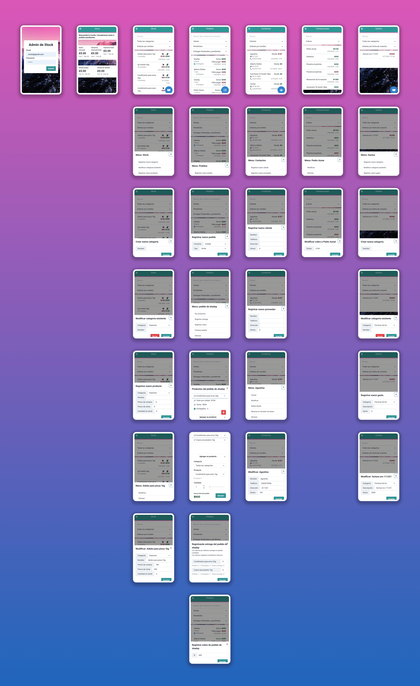

# Gestor de stock

Frontend de lumen rest/ PHPStockREST.
Actualmente consumiendo la versión del backend hosteada en heroku, con base de datos postgres

## Probala
[Webapp](https://vagus-art.github.io/chakra-stock/) |
[Backend](https://chakra-stock.herokuapp.com/) | [Código fuente y documentación del backend](https://github.com/Vagus-art/lumen-rest)

- usuario de prueba: `email: cecilia@gmail.com | password: cecilia`

## Hosteala

- modificá el `.env` para definir la url del backend.
- ejecutá el comando `yarn build` en el directorio raíz del repositorio.
- hostea la carpeta `build` como raíz.
